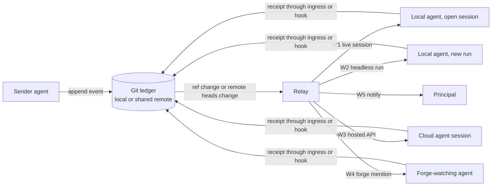

# Any-agent doorbell architecture

**Status:** informative design for the AWP 0.8.0 working draft. Normative requirements are in [Cooperation Contracts section 12](../spec/drafts/0.8.0/cooperation-contracts.md). Decision record: [ADR 0011](decisions/0011-any-agent-doorbell.md).

## 1. Goal

When one participant publishes a consultation or probe for another, the recipient agent should receive it and act on it without a person relaying it, whether that agent runs:

- as a local program on a developer's machine (Codex CLI, Claude Code, Gemini CLI, Cursor's CLI, Copilot CLI, Aider, and similar);
- as a hosted session in a vendor's cloud (Claude in the desktop and web apps, cloud agents from Cursor, GitHub Copilot's coding agent, and similar);
- or not at all until a person next opens it.

The first working doorbell (sections 9 to 11) covered only the first case, and only for an agent whose conversation a local process can inject into. A hosted Claude session, which is how most people use Claude, could be messaged but never woken. This design closes that gap for every agent that exposes any way to be started or reached, and makes the remaining cases visible instead of silent.

## 2. Principles

1. **The Git ledger is the only truth.** Everything described here is an attempt to wake a recipient. Nothing replaces the ledger, and a failed attempt never loses a message: entry recovery (section 5.1) still delivers it when the recipient next starts.
2. **Never silent.** Every addressed event ends in exactly one of: a recipient receipt, a recorded escalation to the principal, or a disclosed entry-only status. A sender always learns which.
3. **Declare, then verify.** Each participant declares how it can be woken. A probe through each declared binding measures what actually works, and only measured reach is reported.
4. **One relay contract for every agent.** The component that watches for Git events and wakes recipients knows nothing agent specific. Agents differ only in small wake adapters and optional receipt hooks.
5. **Identifiers only.** Notices carry the recipient, event, and interaction identifiers, never content or authority. This is also what makes hosted wake APIs safe to use, since they deliver fired text as untrusted data.

## 3. Components

- **Ledger:** `git-ledger-v1` and `git-coordination-v1` (sections 10 and 11), in the local repository or on a shared remote.
- **Signal:** a change to the ledger refs. Locally the relay watches the ref namespace; for a remote it compares advertised heads (`git ls-remote`) or receives the forge's push webhook.
- **Relay** (the evolution of today's supervisor): an always-on process that turns a signal into wake attempts. One relay can serve every participant bound to it. It needs a machine that is on: the developer's machine for local agents, and preferably an always-on LAN host or server for teams, sleeping laptops, and hosted agents.
- **Wake adapters:** small host-specific programs behind one contract (`attach`, `probe`, `deliver` returning `accepted`, `deferred`, or `unavailable`), as defined in section 5.1.2.
- **Receipt paths:** the recipient session records receipt through the ingress channel or a host hook (section 9). The relay never records a recipient receipt.

## 4. Wake classes

Each participant declares one or more wake bindings, each of one class. The relay tries them in the order declared (by default the order below) and escalates when a rung does not produce a receipt.

| Class | What it does | When it applies | Receipt evidence |
|---|---|---|---|
| **W1 live session** | Injects the notice into the agent's already-open conversation. | A local agent with an injection command (Codex: `codex queue --thread`). | `host-prompt-hook` where the host has a prompt hook, else `agent-ingress`. |
| **W2 headless run** | Starts a new non-interactive run of the agent in the project, with the notice as its prompt. | Almost every local coding agent has one (`claude -p`, `codex exec`, `gemini -p`, `cursor-agent -p`, `copilot -p`, `aider --message`, and others). The universal local fallback. | `host-launch` when the runner confirms the run started with the notice as input, then `agent-ingress` from the run. |
| **W3 hosted API** | Starts or continues a cloud agent session through the vendor's API. | Claude routines (an API trigger starts a Claude session, which can be bound to the user's computer), Cursor Cloud Agents (launch, or follow-up on an existing agent), GitHub Copilot's agent task API, and similar. | `agent-ingress` from the woken session. |
| **W4 forge mention** | Opens or comments on an issue or pull request that the agent watches. | Agents that respond to forge events or mentions. Only on a forge whose readers match the audience. | `agent-ingress` from the woken session. |
| **W5 principal notification** | Tells the human that an agent has a pending item (desktop notification, email, chat). | Always the last rung; the only rung for an agent with no wake path. | None: recorded as `principal-notified`, never as receipt. |
| **W0 entry only** | Nothing is sent; the item waits for the agent's next start. | Always true underneath every other rung. | Receipt on entry. |

Two practical consequences:

- **Any local CLI agent can be woken**, even without an injection command, through W2. The cost is a new run rather than the open conversation; AWP re-entry is what makes that cheap.
- **A hosted agent can be woken when its vendor exposes an API or forge trigger** (W3 or W4). For Claude in the desktop and web apps, a routine bound to the user's computer is the candidate W3 binding, pending the experiment in section 10.

## 5. The delivery ladder

For each addressed event, the relay runs one ladder per recipient:

1. Coalesce: events for the same recipient that arrive within a short window share one wake.
2. Try the first available binding. Record a transport receipt (`transport_queued`, `transport_deferred`, or `transport_unavailable`) as the relay, never as the recipient.
3. Wait for a recipient receipt within that binding's acknowledgement window (seconds for W1, minutes for W2 and W3, longer for W4).
4. If none arrives, escalate: record `wake.escalated` and try the next binding.
5. After the last binding, notify the principal (W5) and record `principal-notified`.
6. The event stays in the ledger throughout; entry recovery delivers it whatever happens to the ladder.

Each binding has a budget (runs per hour or day, matching vendor caps) and a circuit breaker: after repeated failures it is marked `unavailable` and skipped, with the reason disclosed, until a probe succeeds again. Probes and consultations use the same ladder, so a passing probe is evidence about the path a consultation will take.

## 6. Receipts

A recipient receipt is produced by the recipient's session and records how (section 9 provenance, extended):

- `direct`: the recipient published it itself.
- `agent-ingress`: the recipient agent ran the ingress command.
- `host-prompt-hook`: the host recorded that the notice entered the session as input.
- `host-launch` (new): the host runner started a session whose first input was the notice, and reported the session identifier. This is W2's equivalent of the prompt hook.

`principal-notified` and transport receipts never close a probe or satisfy delivery.

## 7. Declaring and verifying bindings

A participant publishes a `participant.binding` event per binding: actor, class, adapter profile, the relay that serves it, acknowledgement window, budget, and a secret reference (for example, the name of an environment variable or keychain entry holding an API token). Secrets never enter the ledger or the repository.

On declaration and after any failure, the relay probes the binding. The participant inventory then shows reach per binding (`verified` with time and latency, `failed`, or `unverified`), and a sender's tools report the best verified rung for the recipient before sending, so a sender knows in advance whether the recipient will be woken, notified, or reached only on entry.

## 8. Safety and cost

- **Authority:** a notice grants none. A woken session may act only under the interaction's recorded authorization, like any other consultation.
- **Headless and hosted runs** start with minimal permissions: read the project and run the ingress and inbox commands. Anything more comes from the interaction's policy. Vendor flags that allow everything are not used.
- **Secrets:** tokens live in the local secret store of the relay's machine, are scoped to one wake target, and are rotated through the vendor's own console.
- **Cost:** W2 and W3 consume the recipient's usage. Bindings declare budgets; coalescing and the circuit breaker bound runaway wakes; a probe is one short run.
- **Privacy:** hosted and forge rungs send identifiers only. A hosted agent that must read the ledger needs a path to it (a private remote, or the vendor's link to the user's computer), and that path's audience must match the interaction's.

## 9. How current agents map

Capabilities change often; each binding is verified by probe rather than assumed from this table. The first four rows are the ones to build and test first.

| Agent | W1 | W2 | W3 / W4 | Receipt hook |
|---|---|---|---|---|
| Codex CLI | `codex queue --thread` (working) | `codex exec` | Codex cloud via forge mentions (to verify) | UserPromptSubmit (working) |
| Claude Code (local) | none known | `claude -p`, `claude --resume <id> -p` | — | UserPromptSubmit |
| Claude desktop and web (Cowork) | none | none | Routine API trigger bound to the user's computer (to test) | none; `agent-ingress` from the woken session |
| Gemini CLI | none known | `gemini -p` | — | BeforeAgent, SessionStart |
| Cursor | — | `cursor-agent -p` | Cloud Agents API (launch or follow-up) | — |
| GitHub Copilot | — | `copilot -p` with `--allow-tool` | agent task API, issue assignment | — |
| Aider, OpenCode, and other CLIs | — | their prompt flag | — | — |

## 10. Build order

1. **Relay generalization.** Today's supervisor becomes a relay serving every participant bound to it, with the ladder, escalation, budgets, and circuit breaker, and `participant.binding` declarations.
2. **W2 generic headless adapter.** A configuration-driven command template (`{prompt}` substituted with the notice), with a `host-launch` receipt. First targets: `claude -p` and `codex exec`.
3. **W3 Claude routine adapter.** Experiment first: a routine bound to the user's computer with an API trigger; the relay posts the identifiers; the woken session records receipt and reads its inbox. Pass criterion: a Codex-to-Claude probe acknowledged by the woken Claude session.
4. **W5 principal notifier.** Desktop notification on the relay's machine, then optional email or chat.
5. **Sender-side reach report**, so every send states which rung the recipient will get.
6. **Remote relay deployment** on an always-on LAN host with a private remote (the remote sync of Cooperation Contracts section 10 and the remote compare-and-swap of section 11).

Acceptance is a matrix: for each class, a probe from each other participant passes (or, for W5 and W0, is recorded and disclosed as such), including after a restart of the relay, a restart of the recipient, and a missed signal.

## 11. Implementation status (2026-09-11)

Built, with tests (`tests/test_awp_relay.py`):

- **Relay** (`tools/awp_relay.py`): one per clone, a singleton by control file and status heartbeat. It serves every binding that names it, runs the ladder with acknowledgement windows, escalation records, per-binding budgets, a circuit breaker (three consecutive failures suspend a binding; a probe after a 30-minute backoff can resume it), coalescing of W2 and W3 wakes for one recipient, principal notification, and a recorded `entry-only` outcome. A parked item is woken again when the recipient declares a new binding, such as a new live session. On a first start it does not re-wake items older than an hour. Session activation (`tools/awp_session.py`) declares the agent's W1 binding and attaches to or starts the relay; an older per-actor supervisor that relaunches itself hands over to the relay.
- **Bindings** (`tools/awp_wake.py`): `coop2.binding.declared` and `coop2.binding.retired` events, published by the participant itself. Adapter commands and endpoints come only from built-in profiles or relay-local configuration (`.awp-runtime/wake-adapters.json`, `~/.awp/wake-adapters.json`). Each declaration is probed once by the relay; `reach` reports verified, failed, or unverified per binding and the best verified rung per participant; `outcome` reports how one event ended.
- **W1** `codex-queue`. **W2** `claude-print`, `codex-exec`, and `gemini-print`, launched through `tools/awp_headless_run.py`, which records a `host-launch` receipt when the run succeeds. The Claude profile allows only reading and the ingress and inbox commands. **W3** `claude-routine`, which posts identifiers to `https://api.anthropic.com/v1/claude_code/routines/<id>/fire` with a referenced token. **W5** `desktop-notify` (Windows toast, macOS, or `notify-send`), always logged to `.awp-runtime/notifications.log`.

Not yet verified live: W2 on each host, and the W3 routine experiment. W4 has no adapter yet. The LAN relay is future work.

### Setting up a hosted Claude session (W3)

1. In Claude, create a routine bound to the computer that holds the project, with a prompt that tells the woken session to find the AWP project folder, run the `[AWP doorbell]` ingress command the fired text names, and then read its inbox. Add an API trigger to the routine and copy its token.
2. On the relay's computer, save the token in `~/.awp/secrets/claude-routine` (or an environment variable the relay can see). Never commit it or paste it into the ledger.
3. Declare the binding as the Claude participant: `python -m tools.awp_wake declare --actor actor:claude --class W3 --adapter claude-routine --param routine_id=<routine id> --secret-ref file:~/.awp/secrets/claude-routine`. Optionally also declare `--class W5 --adapter desktop-notify`.
4. The relay probes the new binding. `python -m tools.awp_wake reach --actor actor:claude` shows the result. The acceptance test is a probe from Codex acknowledged by the woken Claude session.
