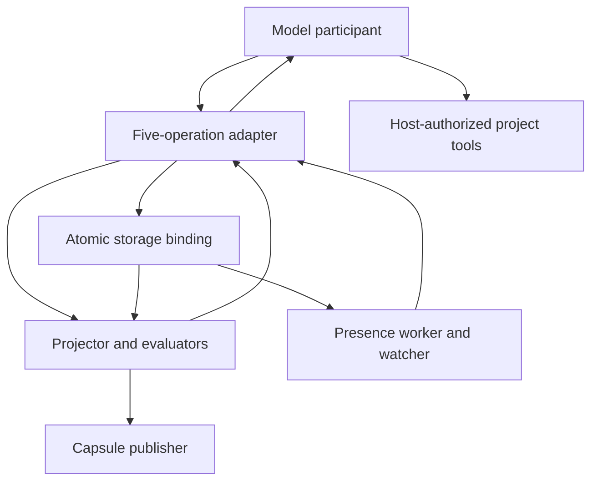

# Model participation architecture and implementation plan

Status: informative proposal for review. The operations, response fields, and role names below are proposed interfaces, not existing AWP wire records or new conformance claims. Adoption that changes released semantics requires a new versioned draft. This document does not change the meaning of C1 in an existing version.

## 1. Intended outcome

A smaller model should be able to enter a project, understand relevant work, announce its own work, respond to conflicts, and leave a useful handoff using a short instruction and five operations. It should not need to reconstruct the whole project event graph or manufacture integrity metadata to participate.

The interface must remain usable by a model through ordinary structured text. A tool-enabled host may execute its requests automatically. A file-based host or human may execute the same requests and return receipts. A model without a publication mechanism can prepare requests and analyze a supplied capsule, but cannot confirm shared publication.

The design preserves AWP's claim taxonomy and authority ceiling. It reduces the number of decisions and bookkeeping fields the model must manage. Runtime components remain accountable for the guarantees they provide.

## 2. Responsibility boundaries

| Component | Owns | Does not establish by itself |
|---|---|---|
| Model participant | Goal, intended scope, relied-upon facts, actual result, evidence interpretation, unresolved questions | Durable publication, global freshness, authenticated identity |
| Participation adapter | Five operations, input validation, context selection, record construction, error explanations | Truth of model claims or permission for project writes |
| Projector and evaluators | Causal replay, reference resolution, transitions, conflict state, freshness, typed evaluation | Unobserved external facts or authority outside receiver policy |
| Storage binding | Atomic publication, idempotency, retrieval, frontier receipts, retention | Semantic compatibility of concurrent changes |
| Capsule publisher | Serialized semantic checkpoint projection and integrity metadata | Continuous liveness or freshness beyond its recorded frontier |
| Presence worker and watcher | Renewal, expiry observations, bounded notifications and cursor recovery | Exclusive ownership or permission to mutate |
| Host policy and execution tools | Authenticated session binding where available, external permissions, actual file/test operations | Automatic trust in imported instructions |

These are logical roles. A small deployment can implement them in one local process with a transactional store. The same model interface can later use separate services.



Only the host's execution tools perform external project actions. Coordination responses report coordination conditions. They do not enlarge the authority ceiling.

## 3. Five model operations

All handles below are returned by the adapter, scoped to a project and session, and treated as opaque by the model. The adapter rejects expired or mismatched handles. Request IDs are generated and persisted by the host before submission so retries survive a lost response.

| Operation | Model supplies | Adapter returns | Durable effect |
|---|---|---|---|
| `read` | Goal or task, relevant scope, optional prior context handle | Bounded briefing, context handle, active interactions, missing context, mode and reach | None on the workstate; host may establish advisory presence separately |
| `announce` | Context handle, intended change, scope/access, relied-upon facts | Intent handle, publication receipt, interactions, next permitted coordination step | Intent and scope records; related diagnostics |
| `interact` | Intent handle, interaction handle, proposed disposition, rationale/evidence | Recorded proposal, pending approvals, accepted disposition or unresolved state | Proposal, acknowledgement, negotiation or arbitration records as applicable |
| `publish` | Intent handle, actual scope, result summary, evidence references, unfinished work | Result handle, verification classification, freshness/readiness outcome, receipt | Change/result records and evidence associations; relevant lifecycle events |
| `checkpoint` | Intent/result handles, next action, unresolved work, `continue` or `exit` | Checkpoint receipt, capsule frontier/digest, handoff completeness | Semantic checkpoint and capsule projection; terminal intent/presence release on successful exit |

An `announce` for an existing intent can propose additional scope. It must identify the intent and current context, and receives a fresh overlap evaluation before work expands. This uses the same operation rather than introducing an unrelated editing protocol.

Each operation has its own input schema. The model is not required to emit Core envelopes, event ancestry, timestamps, record revision counters, capsule boundaries, generated digests, or storage paths. Those remain inspectable in resulting AWP records and receipts.

### Response contract

Responses separate three questions:

* Publication: `confirmed`, `pending`, `rejected`, or `not_applicable`.
* Coordination: `clear`, `warning`, `needs_input`, `blocked`, or `unverifiable`.
* External authority: an explicit ceiling and any separately required approval.

`clear` means that the checks declared in the receipt found no blocking condition within the declared coverage. It is not a guarantee against future events or an authorization token. A confirmed proposal can still have `needs_input`; storing a proposal is not accepting its terms.

Every response includes project identity, operation/request identity, supported profile, relevant handles, source frontier, coverage, mode/reach, diagnostics, and one recommended next step. Publication responses also include event identities and the binding's receipt. Responses with missing coverage must say what is missing.

Illustrative request, after `read` returns `ctx:17`:

```json
{
  "operation": "announce",
  "context": "ctx:17",
  "summary": "Update watch battery comparisons",
  "scope": [{"path": "data/battery.csv", "access": "write"}],
  "relies_on": [{"ref": "claim:battery-method@2", "reason": "Comparison uses this measurement method"}]
}
```

Illustrative response:

```json
{
  "request_id": "request:81",
  "project": "project:watches",
  "intent": "intent:81",
  "publication": "confirmed",
  "coordination": "warning",
  "frontier": ["evt:81"],
  "coverage": {"scope_complete": true, "semantic_analysis": "unavailable"},
  "authority_ceiling": ["read_only", "local_write"],
  "interactions": [{"handle": "interaction:9", "summary": "Another active intent writes this file"}],
  "next": {"operation": "interact", "reason": "Record an ordering proposal before continuing under project policy"}
}
```

Transport/session metadata omitted from the model request is added by the host. No example receipt should be accepted merely because a model repeats its text; confirmation comes from the selected binding.

## 4. Bounded context for smaller models

The briefing contains a fixed order: current goal; authority and constraints; relevant accepted decisions; checkpoint and next action; active overlapping work; relied-upon facts and freshness; available operations. Each actionable item carries a stable reference and evidence classification.

The adapter selects context using scope and dependency indexes. It includes dependencies and policy necessary for the requested action even when those lie outside the requested file or directory. It exposes additional pages through `read` rather than silently truncating safety-relevant information.

Proposed starting budgets for experiments are a 600-word participant instruction and a 2,000-token default briefing. These are design targets, not measured model limits. If required context exceeds the budget, split the task or ask for another page; mark the action `unverifiable` until required context is available. A summary never substitutes for an unresolved conflicting record.

The response identifies whether overlap coverage is physical-only, includes reported semantic relationships, or includes a supported semantic analyzer. Absence of a match in an incomplete index cannot become a no-conflict conclusion.

### Participant instruction

1. Read project context before work. Use its goal, constraints, authority ceiling, and next action.
2. Announce intended changes and everything you currently expect to touch. Wait for publication confirmation.
3. Follow the returned coordination outcome. Record interaction proposals when needed; do not treat another participant's silence as agreement.
4. Refresh context when scope changes, dependencies change, a warning arrives, or before integration and handoff. Announce additional scope before writing it.
5. Publish what actually changed and attach available evidence. Identify untested conclusions and unfinished work.
6. Checkpoint at meaningful milestones and before exit. Treat exit as incomplete until the checkpoint receipt confirms the handoff.
7. If context, publication, or evidence is unavailable, report that condition. Preserve unresolved conflicts and ask for the specific missing input.

Host policy may require a stricter gate than the default advisory workflow. The participant receives that policy with the briefing.

## 5. Adapter execution and failure recovery

For each mutating request the adapter validates the request/session, resolves the context handle, refreshes relevant state, checks policy and applicable preconditions, constructs candidate events, and publishes through the binding. The publication transaction checks the expected relevant record revisions. If those changed, the adapter refreshes and returns the changed conditions; it must not replay a semantic decision blindly.

The binding atomically records request identity and accepted event identities. Identical retries return the original receipt. Reusing a request identity with different content is rejected. A lost response after commit therefore does not duplicate an intent or checkpoint.

A publication receipt distinguishes successful storage from successful semantic application. A conflict discovered while publishing remains visible in the response and subsequent projection. Project mutations outside the binding still require a host gate for stronger concurrency guarantees; advisory C1 cannot eliminate the interval between checking and writing.

| Failure | Required proposed behavior |
|---|---|
| Response lost after commit | Retry the same request identity and retrieve the original receipt |
| Concurrent incompatible update | Preserve both events; return interaction and fresh context |
| Missing or incomplete history | Report missing coverage and prevent a false current-state claim |
| Unknown required semantics | Mark the affected action unverifiable; allow unaffected display/export |
| Artifact or evaluator unavailable | Preserve reported evidence; return unknown/error under policy |
| No writable shared binding | Expose snapshot-only/unavailable mode and reach; prepare requests if useful |
| Capsule projection fails after result publication | Keep durable result and pending checkpoint; retry projection; report incomplete handoff |
| Model or host crashes | Presence expires through the declared registry mechanism; retain unfinished intent and last confirmed checkpoint |

No normal request changes the governing specification, grants authority, or silently establishes a cross-host deployment.

## 6. Freshness architecture

Separate a historical reference from a validity dependency. `record@2` identifies what was used. A dependency states which property must remain true and what happens if it changes.

For example, a result can retain its reference to measurement-method revision 2 after revision 3 exists. If revision 3 changes only a display label and the relied-upon measurement rule remains identical under a defined predicate, the result need not become stale. An unsupported predicate yields unknown, never inferred success.

Normalize dependencies into typed inputs: record/revision, state-space/revision, artifact/digest, or environment/evaluator constraint. Use the owning type's revision namespace. A Git revision is not an integer record revision.

The projector maintains reverse dependency indexes. Each valid semantic change schedules affected predicates. Store stale causes as a shared provenance graph with distinct causes and edges, allowing paths to be reconstructed without eagerly enumerating every path. Cycle detection and bounded traversal must distinguish completed analysis from incomplete analysis. Revalidation clears a cause only with fresh evidence under the relevant lifecycle rule.

Because the current specification asks for all causes and paths, adopting a compact graph representation must demonstrate equivalent information preservation. Any change to propagation semantics belongs in the new draft and needs independent expected outcomes.

## 7. Capsule, entry, presence, and exit

Use one explicitly identified `<project>.awp.md` as the durable discovery and semantic handoff surface. Its metadata identifies the exact specification and binding reference. Multiple candidates require explicit selection. No additional `.awp.json` is introduced by this proposed architecture.

On entry, the host reads the capsule then compares its frontier with the available ledger. It supplies refreshed state when replay is available, or clearly identifies the capsule's freshness limit. The capsule does not need to be rewritten on every entry.

On checkpoints, one logical publisher per workstate compares expected capsule frontier and digest before replacement. Replacement is atomic. Cross-process deployments need recoverable ownership; cross-host replicas need fencing or an equivalent stale-writer exclusion mechanism.

On exit: stop new work; durably publish actual results and evidence; request checkpoint; publish the capsule; record successful handoff and terminal intent; release presence. These can span multiple transactions, so the exit operation is a recoverable state machine with idempotent steps. If new relevant events arrive during projection, refresh and retry within policy bounds. Never declare all later events included in an earlier checkpoint.

Heartbeats and watcher cursors remain runtime state outside the capsule. A host worker renews participation while its session is alive. An idle watcher delivers new, expired, and conflicting participant observations through a bounded queue. Delivery requires a host wake-up or notification facility; a specification alone cannot wake an inactive model.

## 8. Conformance and implementation scope

Keep the existing C1 designation honest. A participant using the five operations is a participant in a declared binding; this alone does not make that model or adapter a complete C1 processor.

The proposed next draft should give each requirement an owner (participant, adapter, projector, binding, publisher, evaluator), triggering operation, capability prerequisite, and expected failure outcome. A role manifest identifies who satisfies each required behavior. A composed C1 claim requires evidence for the complete applicable set, including delegation boundaries.

The base participation profile supports read, intent/scope publication, interactions, result evidence, and checkpoint handoff. The experimental [CC-1 Cooperation Contract](../spec/drafts/0.7.0/cooperation-contracts.md) is the selected separately named profile: it adds bounded symbiotic interactions and known-incompatible guarded-scope blocking without redefining Coordination C1. Integration assurance activates contracts, typed preconditions, verification, readiness, and integration records when required by the work. Enforcement activates only with an identified enforcing binding.

## 9. Scalability without increasing model burden

Start with one local transactional binding and indexed project/scope/dependency queries. Persist watcher cursors and bound each notification batch. Coalesce repeated liveness notifications while retaining durable semantic changes and explicit observation gaps.

Measure active participants, semantic events per second, heartbeat load, dependency fan-out, capsule lag, and request latency separately. Partitioning by project is straightforward; partitioning within a project requires cross-partition dependency and wildcard-scope coverage. A hot scope may require paginated conflict sets and backpressure.

Do not advance to distributed storage simply to support the model interface. Establish the tested operating envelope first. Distributed ownership, authentication, fencing, retention gaps, and failover are later binding concerns with the same five operations.

## 10. Implementation plan and review gates

### Phase 1: Freeze the participation contract

Create a requirement-to-role matrix for the existing Coordination requirements. Write five request schemas, one response schema, explicit operation state machines, and worked success/failure conversations. Define the context handle, idempotency receipt, coverage, and authority fields precisely.

Gate: each ordinary task can be explained with the short participant instruction; every mandatory behavior has an owner; no required advanced capability is silently bypassed. Review this architecture before normative adoption.

### Phase 2: Implement the local participation adapter

Wrap `tools/awp_coordination.py` behind the proposed operations. Reuse `tools/awp_presence.py` for runtime participation. Add receipt persistence and idempotent retries. Keep optional fields out of the default model request. Add a context builder with scope/dependency closure and explicit coverage limits.

Gate: two participants complete non-overlapping work, detect overlapping writes, expand scope, recover a lost receipt, and return an incomplete-context outcome without manual construction of event envelopes.

### Phase 3: Correct and complete projector boundaries

Audit `tools/awp_projector.py` against independently authored specification cases. Priorities include duplicate identity conflicts, causal diagnostic order, creation state and event kind, unsupported events, typed dependency namespaces, historical reference resolution, contested descendants/reconciliation, and truthful conformance reporting.

Implement freshness predicates and propagation with explicit cause graphs. Separate structural validity, semantic application, and evidence trust. Avoid using projector output itself as the oracle for expected fixtures.

Gate: permutation and retry cases agree on semantic state; invalid events cannot supply accepted state; incomplete analysis remains visible; typed repository dependencies are accepted and evaluated in their own namespace.

### Phase 4: Complete durable handoff

Implement canonical capsule selection from capsule metadata, frontier-aware entry, serialized checkpoint replacement, exit retry states, crash recovery, and runtime watcher delivery. Provide a compatibility reader for explicitly selected older capsules without rewriting their version claims.

Gate: simultaneous exits cannot lose a confirmed result; a failed capsule replacement remains recoverable; a fresh entrant sees newer confirmed events or an explicit freshness limitation; heartbeat churn never rewrites the semantic capsule.

### Phase 5: Evaluate smaller model participation

Run the same task set with at least two smaller model families and a stronger reference participant through an identical binding. Pin model versions and record prompts, tool responses, retries, context sizes, publication receipts, and outcomes. Select concrete models at execution time rather than assuming availability here.

Tasks: ordinary re-entry; compatible readers; conflicting writers; scope expansion; changed relied-upon fact; stale capsule; missing evidence; lost response; crash during exit; pending human arbitration. Include runs with distracting irrelevant project history.

Proposed acceptance targets: at least 95% first-attempt schema-valid requests; all eventual publications linked to confirmed receipts; zero observed silent losses or unsupported authority promotions in the finite suite; required conflicts and freshness gaps surfaced in every designed case. Report task success, intervention rate, tokens, and latency by model and scenario, with sample sizes and uncertainty. These targets are not current results or universal safety guarantees.

Gate: failures are attributable to a specific operation or context requirement; simplify the contract or context presentation before adding instructions indefinitely. Run an ablation comparing the full specification prompt with the short participation contract under the same host capabilities.

### Phase 6: Publish versioned semantics and interoperability evidence

Create the correctly versioned draft, schemas, operation-to-record mappings, conformance roles, migration guide, and generated bundle. Have an independent implementation consume the same portable fixtures and compare projections and receipts at the semantic level. Scale and fault-test only the deployment profiles claimed.

Gate: compatibility differences are explicit; delegated responsibilities have evidence; the advertised profile matches implementation coverage. Promotion to complete C1 follows its applicable normative requirements, not the number of model operations implemented.

## 11. First concrete work package

The next implementation should deliver the role matrix, five operation schemas, receipt schema, and ten worked conversations before extending runtime features. This makes the simplification reviewable and gives the smaller-model evaluation a stable target.

Existing tools are reusable components, but neither their current tests nor the four projector fixtures establish this proposed participation contract. The current repository also retains older discovery/release assumptions; implementation must reconcile those through explicit version selection rather than silently repinning capsules.
