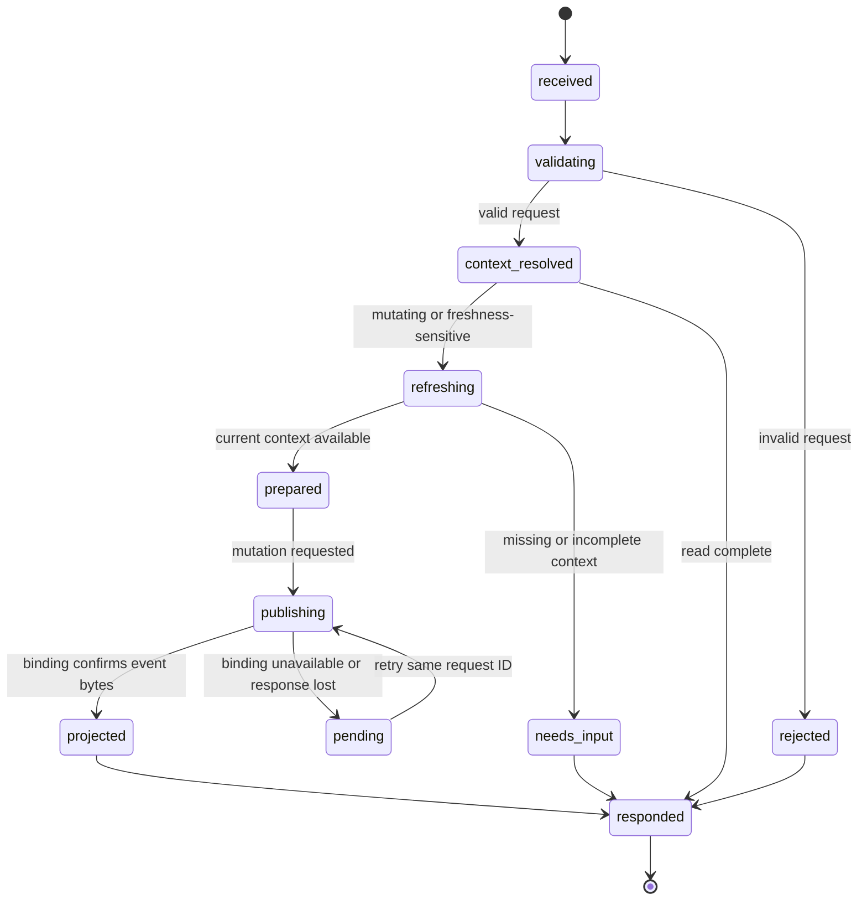
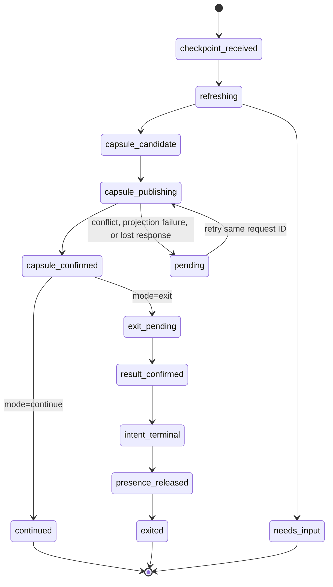

# Model participation operation state machines

This document defines the behavior of the experimental model participation contract in terms that an adapter can implement with a small number of durable states. It complements [the architecture](model-participation-architecture.md), [the responsibility matrix](model-participation-matrix.md), and the machine-readable schema at `schemas/awp-participation-0.1.schema.json`.

The model sees an operation response. The adapter owns the state machine and may persist intermediate states. A state transition is complete only when its stated receipt or response condition is true.

## Shared rules

Every request follows this common path:



The request ID is created before the first publication attempt. Retrying the same request ID with identical canonical request content returns the original receipt. Reusing it with different content enters `rejected` with an integrity diagnostic. A request can be safely retried from any state whose receipt was not confirmed.

The adapter records a state transition before performing an operation that may be interrupted. The binding records the request ID and event IDs atomically with publication. The projector does not mutate the request state; it returns semantic results that the adapter records against the request.

The terminal response states are:

| Response state | Meaning | Retry |
|---|---|---|
| `responded` with `clear` or `warning` | Request completed within declared coverage | Continue according to `next` |
| `responded` with `needs_input` | A human or model decision or more context is required | Supply the requested input or call `read` |
| `responded` with `blocked` | Policy or an unresolved guarded condition prevents the requested step | Resolve the named condition; do not bypass it by retrying unchanged |
| `responded` with `unverifiable` | Required history, evaluator, identity, or binding coverage is unavailable | Restore coverage or limit the requested action |
| `pending` | The adapter cannot yet confirm publication or projection | Retry with the same request ID |
| `rejected` | The request is malformed, unauthorized by host policy, or conflicts with a prior request identity | Correct the request or obtain a separately authorized action |

`pending` is not success. A model may prepare an answer while publication is pending, but it must not describe the event as confirmed.

## `read`

`read` is non-mutating and has the shortest state machine:

```text
received → validating → context_resolved → responded
```

The adapter resolves exactly one named capsule or workstate, checks the governing specification, compares available event and capsule frontiers, and builds a bounded page. It returns `context`, `frontier`, `coverage`, authority ceiling, active interactions, and `next`. If the requested page cannot include a required dependency, it returns `needs_input` or `unverifiable` with a page request. It never turns truncation into `clear`.

The adapter may cache a context handle, but the handle represents the frontier and coverage used to build that page. Mutating operations must refresh or reject a stale handle according to policy.

## `announce`

`announce` creates or expands a work intent:

```text
received
  → validating
  → context_resolved
  → refreshing
  → overlap_evaluated
  → candidate_prepared
  → publishing
  → projected
  → responded
```

The adapter publishes an intent and its revision-pinned scopes together when starting work. It checks the context handle, actor/session, project binding, base revision, and complete intended scope before publication. It evaluates known physical and declared semantic interactions after the candidate records exist.

An overlap warning does not erase the confirmed intent. Under advisory policy the response is `confirmed` plus `warning`, with an `interact` next step. Under a blocking policy the event may be recorded as `pending` or `confirmed` according to binding semantics, but the response is `blocked` and the model must not perform the guarded mutation.

An existing intent can be expanded through `announce`. The adapter creates a new scope revision or associated scope event, refreshes overlap, and returns the complete current declared scope. It must never silently infer newly touched paths from a prior announcement.

## `interact`

`interact` records the model's response to an active overlap or coordination question:

```text
received → validating → context_resolved → refreshing → candidate_prepared → publishing
                                                                            ↙          ↘
                                                                    needs_input       projected
                                                                                         ↓
                                                                                     responded
```

The adapter selects the interaction by stable handle, verifies that the referenced records and revisions are still current, and records the proposed disposition. Possible outcomes are:

| Outcome | Durable meaning | Model action |
|---|---|---|
| `acknowledged` | The interaction was seen; no agreement is implied | Follow the returned policy and next step |
| `proposed` | A disposition was offered but is not accepted | Wait for the required participant or authority |
| `ordered` | An order is recorded under the applicable policy | Follow only the named order and scope |
| `escalated` | The issue requires a user or authority decision | Stop the guarded step and await input |
| `unresolved` | Available information cannot support a safe resolution | Request context, evidence, or arbitration |

Silence, a successful write, or a model assertion cannot transition an interaction to accepted or decided. The adapter returns `needs_input` when another participant or trusted authority must act.

## `publish`

`publish` records what the model and host actually produced:

```text
received → validating → context_resolved → refreshing → candidate_prepared
                                                        ↓
                                                   publishing
                                                        ↓
                                                   projected
                                             ↙              ↓              ↘
                                       stale/unknown     verified        warning
                                             ↓              ↓              ↓
                                          responded      responded      responded
```

The model supplies a concise result, actual scope, evidence references, and unfinished work. The host supplies observed artifacts, state-space revisions, and executable evidence when available. The adapter creates a change-set or result record and binds verification to the exact subject and base revision.

`verified` describes the returned evidence classification, not the model's confidence. `stale` means a relied-upon dependency changed or became unknown. The response includes the cause and the operation required to revalidate or rebase. A successful source-control operation without the required semantic verification cannot produce a completed integration result.

## `checkpoint`

`checkpoint` has two modes. Continuing work uses the first path; exit uses the second:



For `continue`, `capsule_confirmed` is the terminal success condition. For `exit`, the adapter must complete these ordered steps:

1. stop accepting new material work;
2. publish actual results and evidence, or record why they are incomplete;
3. refresh the relevant frontier and project the capsule;
4. confirm the capsule frontier and digest;
5. publish the terminal intent or handoff result;
6. release the presence session;
7. return `exited` with the final receipt.

Steps are idempotent and recoverable. If step 3 fails, the result remains durable and the adapter returns `pending` with `next=checkpoint`. If step 5 fails, the capsule remains current but the handoff is incomplete. If step 6 fails, the session expires through the heartbeat mechanism; the adapter must report that release was not confirmed. The adapter must not release presence before the final semantic publication and capsule confirmation.

## Operation-to-record mapping

| Operation | Minimum AWP records/events | Receipt condition |
|---|---|---|
| `read` | None; may consume Core, Capsule, Synchronization, and Coordination projections | Context handle identifies frontier and coverage |
| `announce` | `intent`, `scope`, and corresponding creation/update events | Binding confirms event IDs and projector returns projection |
| `interact` | Applicable `overlap`, acknowledgement, `negotiation`, or `arbitration` records | Proposal publication confirmed; acceptance remains a separate result |
| `publish` | `change_set`, `verification_result`, `precondition_result`, or evidence associations as applicable | Result event confirmed and bindings report freshness/verification outcome |
| `checkpoint` | Core checkpoint/handoff projection, synchronization delta when used, terminal intent, and presence release observation on exit | Capsule publisher confirms expected frontier/digest; exit adds terminal intent and release receipt |

The mapping is minimum, not a requirement to emit every record for every task. The adapter chooses the smallest record set that preserves the model's declared intent, scope, relied-upon facts, result, evidence, and handoff.

## Implementation sequence

Implement the state machines in this order:

1. `read`, including bounded context and explicit incomplete coverage;
2. `announce`, including idempotent publication and advisory overlap responses;
3. `checkpoint` with `continue`, including capsule frontier checks;
4. `publish`, including actual-scope comparison and evidence classification;
5. `interact`, including pending user decisions;
6. `checkpoint` with `exit`, including crash recovery and presence release.

At every stage, keep the model request schema stable and expand only the adapter response fields required to explain the new state. The first executable adapter should implement local file or SQLite binding semantics and declare its reach. Cross-host leases, authenticated authority, and enforcement are later binding profiles.
